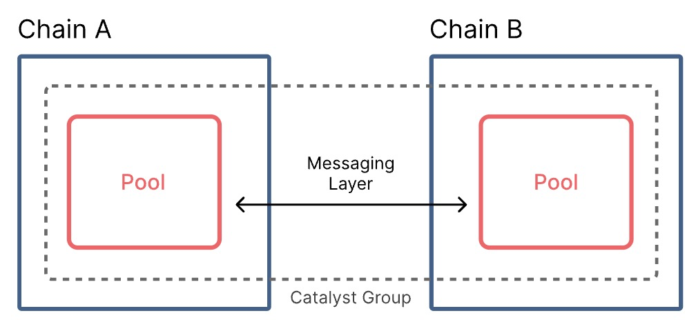

Catalyst is a cross-chain AMM that only needs an interoperability messaging layer to operate. This enables easy-to-use, secure, and fast cross-chain swaps. Traditional AMMs price assets based on their internal state, which means the balances of assets within the AMM. Catalyst splits the state of the AMM across different chains: pools of assets can be created on different chains and connected together by a cross-chain messaging layer.

Catalyst works by being lightweight and extensible enough to live on any chain—irrespective of virtual machine, consensus mechanism, etc. Catalyst uses a concept called "unit of liquidity": a value abstraction that can be easily transferred between pools asynchronously to allow for universal comprehension between any Catalyst smart contract on any chain. As a result, any chain that integrates Catalyst can automatically move value to/from any other Catalyst-enabled chain.

