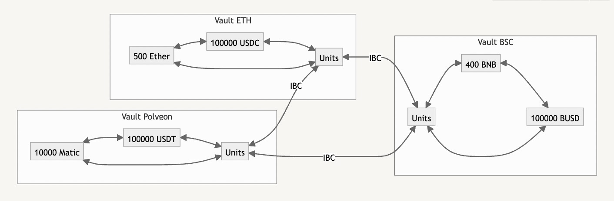

# Liquidity Pools

Catalyst is extensible and can replicate any type of AMM pool such as Curve stableswap, UNI v2 and Balancer multi-asset pool.

Catalyst keeps liquidity on-chain in Vaults without partitions. This allows anyone to use the complete liquidity in a Catalyst vault for any pair locally (ETH to USDC) or cross-chain (Matic to BNB).

Each Vault contains 1 or more assets and can be connected to none, one or more other vaults to allow swaps between their assets. When vaults are connected, they form a pool. Within a pool, any asset can be exchanged for any other asset.

To facilitate swaps between different vaults, tokens are converted into the value abstraction: Units. This is done via the internal price curve of the vault. Using a cross-chain messaging layer, the Units can be transferred to any connected vaults, followed by the conversion of the Units to the desired token.

